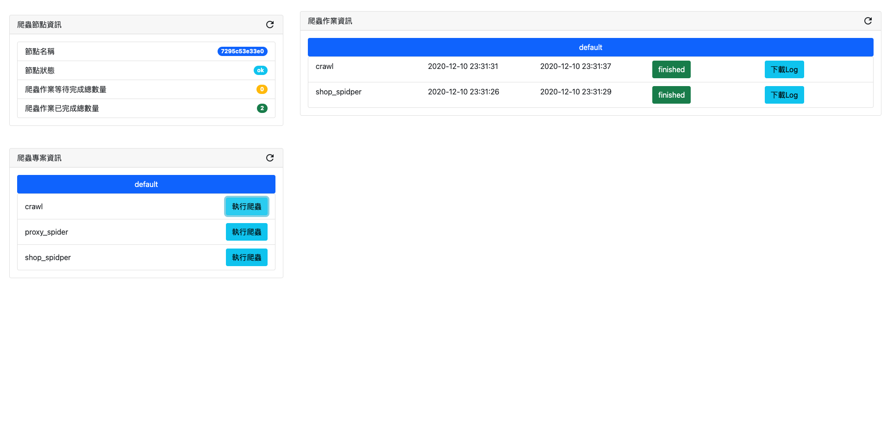

# ScrapydDashboard
## 本系統可提供UI管理和執行Scrapy爬蟲程式，和設計排程服務以定時執行Scrapy爬蟲作業 
<br><br/>
## 資料夾結構
- crawler
  - Scrapy爬蟲服務
- reverse_proxy_server
  - Nginx反向代理伺服器
- schedule
  - 執行爬蟲工作的排程服務
- web_site
  - 爬蟲儀表板管理網站     
## 系統啟動方式
1. 在根目錄執下以下指令
``` bash
docker-compose up -d --build
```
2. 在Browser開啟 [http://localhost:5269](http://localhost:5269) 網址
3. 輸入帳號密碼
   - 帳號：admin
   - 密碼：123
## 系統截圖


# reference
- https://medium.com/%E6%89%8B%E5%AF%AB%E7%AD%86%E8%A8%98/react-swr-485b8e41ef78
- https://material.io/resources/icons/?icon=refresh&style=baseline
- https://github.com/vercel/swr
- https://scrapyd.readthedocs.io/en/stable/


